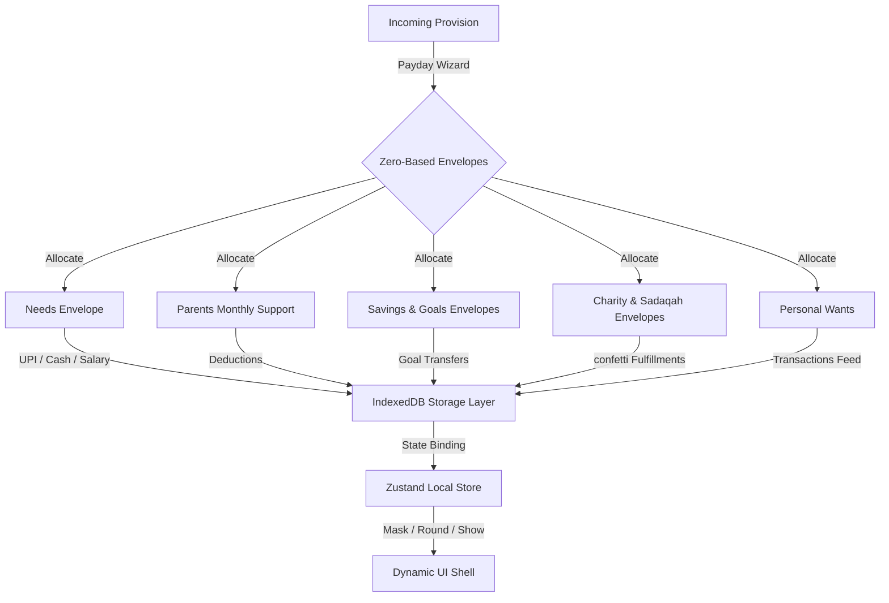

# ⚖️ Mizan — Personal Islamic Wealth Companion

<div align="center">
  
  
  <h3>Balance • Gratitude • Moderation • Accountability</h3>
  
  <p align="center">
    
    
    
    
  </p>
</div>

---

**Mizan** (meaning *Balance*) is a personal financial companion designed around the Islamic concept that wealth is an **Amanah (Trust)** from Allah. Rather than introducing guilt about spending, Mizan acts as a reflective lens to align your daily financial provisions (Rizq) with your life values.

---

## 🌟 Core Pillars

Mizan is engineered to answer five questions instantly on launch:

1. **How much provision (Rizq) do I currently have?**
2. **Where has it gone?**
3. **Am I living within my means?**
4. **Am I progressing toward my goals?**
5. **Does my spending reflect my values?**

---

## 🛠️ System Architecture & Data Flow

Mizan works completely local-first and offline-first. Your data never leaves your device unless you configure a sync layer. 

Here is how the zero-based allocations flow from your salary arrival:



---

## 🎨 Design Philosophy & Themes

Mizan implements the **Modern Sage** color palette to provide a clean, visual canvas reminiscent of native Apple Health and Fitness interfaces:

* 🟢 **Primary Sage** (`#8FAF9B`) — Balance indicator, goal completions, and branding highlights.
* 🔲 **Dark Sage** (`#607567`) — Primary buttons, locks, and dark surface states.
* 🍂 **Accent** (`#AFC5B3`) — Borders and visual accents.
* 🌑 **Dual Mode Toggle**: Stacked floating controls swap variables between **Light Sage Canvas** and **Dark Charcoal Sage** (#121412) dynamically.

---

## 🚀 Key Features

* **Onboarding Setup Wizard**: Configure your custom profile, establish custom accounts, and select initial balances.
* **Custom Security PIN**: Lock screen requires validation against a user-configured 4-digit PIN (biometric scanner bypass emulations included).
* **Payday Wizard**: Step-by-step zero-based allocator that guides you from salary deposit to exactly ₹0 remaining.
* **Islamic Wealth Modules**:
  * **Nisab-Aware Zakat Calculator**: Calculates Zakat dynamically (2.5%) against Gold (85g) and Silver (595g) threshold averages.
  * **Sadaqah Tracker**: Progress rings mapping monthly contribution goals against actual donations.
* **Privacy Shroud**: Dynamic header toggles values between Visible, Masked Asterisks (`₹ ••••`), and Rounded Approximations (`~₹70K`).
* **Financial Health Diagnostic**: SVGs rendering score calculations based on savings rates, budget limits accuracy, and charity consistency.

---

## ⚙️ Running Locally

Follow these commands to launch the application locally:

### 1. Install Dependencies
```bash
npm install
```

### 2. Run the Development Server
```bash
npm run dev
```
Open [http://localhost:3000](http://localhost:3000) in your browser.

### 3. Build for Production
```bash
npm run build
```

---

## 📁 File Structure

```text
mizan/
├── public/
│   ├── manifest.json      # PWA application definitions
│   ├── sw.js              # Service Worker asset cache router
│   └── icons/             # Custom minimal PWA assets
├── src/
│   ├── app/
│   │   ├── globals.css    # Custom CSS variables & Dark mode themes
│   │   ├── layout.tsx     # Viewport, Font load, HTML body wrapper
│   │   └── page.tsx       # Tab router, nav bars & Sun/Moon toggler
│   ├── components/
│   │   ├── AccountSwiper.tsx   # Apple Wallet horizontal carousel
│   │   ├── OnboardingWizard.tsx # Name, PIN & Initial balances setup
│   │   ├── PwaClientWrapper.tsx # Service worker loader & PIN verification
│   │   └── IslamicFinanceModule.tsx # Zakat & Sadaqah dashboards
│   ├── lib/
│   │   ├── db.ts          # Client IndexedDB helper functions
│   │   └── utils.ts       # Privacy-aware formatting rules
│   └── store/
│       └── useMizanStore.ts # Zustand global state management
```
